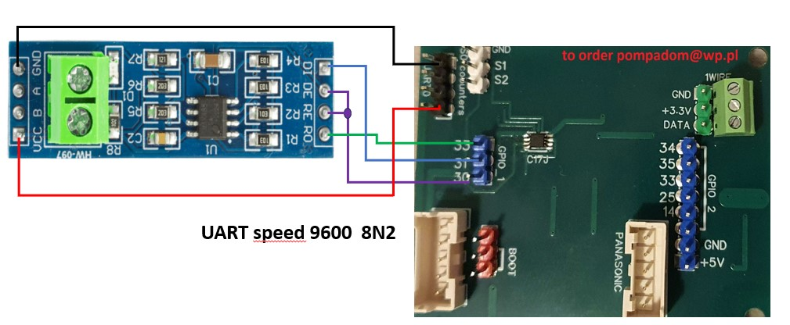

# Modbus is the new module of HeishaMonBoth interface for RTU Modbus devices like Power Meter, Water Meter e.g.

This Module use additional board to convert the RS485 RTU Modbus to RS232 Serial UART signals.

## Modifications for SoftwareSerial

### rs485modbus.h
```
*#define MODBUS_REDE_PIN GPIO_NUM_21  // RE/DE  GPIO18 is used for RS485 direction control for halfduplex devices
#define MODBUS_RX1_PIN GPIO_NUM_18  	
#define MODBUS_TX1_PIN GPIO_NUM_19*
```

### gpio.h

*struct gpioSettingsStruct {
#if defined(ESP8266)

unsigned int gpioPin[NUMGPIO] = {1, 3, 16};
unsigned int gpioMode[NUMGPIO] = {INPUT_PULLUP, INPUT_PULLUP, INPUT_PULLUP};
#elif defined(ESP32)
unsigned int gpioPin[NUMGPIO] = {5,18,19,21,22,23,32};
unsigned int gpioMode[NUMGPIO] = {OUTPUT,  OUTPUT,OUTPUT,INPUT_PULLUP, INPUT_PULLUP, INPUT_PULLUP, INPUT_PULLUP, };
#endif
};*

//GPIO1 pin1 ESP_GPIO_21   ESP_pin33  / TX for Software Serial
//GPIO1 pin2 ESP_GPIO_19   ESP_pin31  / RX for Software Serial
//GPIO1 pin3 ESP_GPIO_18,  ESP_pin30  / DE/RE for Software Serial

### rs485modbus.cpp

*void setupModbus(){  // **************************************************************************************
if (heishamonSettings.modbusOn){
//  Serial.end();
// RTUutils::prepareHardwareSerial(Serial);
swSerial.begin(9600, EspSoftwareSerial::SWSERIAL_8N2, MODBUS_RX1_PIN, MODBUS_TX1_PIN, false,500,11);  //Set up Serial port for ModbusRTU 8N1 must be set the same on the Modbus device
swSerial.enableIntTx(false);
......*

You can use the inteface with the DE/RE control pin but the module available on Aliexpress require replace 20k resistor with 120 ohm . Perhaps other implementations of this module do not require modification, but the one visible in the photo has resistor values R5 and R6 that are inconsistent with the MODBUS standard.

 




or like this without flow control pins DE/RE


The Modbus module use the "EspSoftwareSerial" librrary to create additional serial port to connect the RS485 converter to HeishModBoth. The transmission modbus Device parametters must be set to speed -**9600**, bits -**8**, parity -**None**, stop bits -**2** (**9600 8N2** ) and modbus device address must be set this same as the parameter "devAddress" in Modbusxxx.json config file.
It is also possible to connect the MODBU converter interface to the hardware UART0 port, however, this requires blocking the sending of logs to this port.

From the 3.8.1 verison, HeishaMonBoth allows send and handling up to 4 queries to the same device or up to 4 different Modbus devices connected to this same bus, depending what the device address is set by parameter "devAddress". Each Modbusxxx.json file define one query and his name must start from Modbus  word eg Modbus12.json, Modbus3new,json. Each query allows handling up to 16 measured values from the device response. So you can read 16 values from each 4 different devices, 64 values from 1 device or any other combinations defined by the user. The user can define queries for non-standard devices by himself using the description of how to create and upload modbusxxx.json files to the board. The software supports up to 4 Modbusxxx.json files, if more than 4 counter definitions are uploaded only the first 4 will be used and the rest will be ignored.

For convenience and to check the correctness of the definition, it is worth using Online tools to verify the correctness of the JSON file

[**JSON-deserialize-online**](https://codebeautify.org/json-deserialize-online)

and also to serialize the JSON file to reduce the size of the definition file saved in the ESP32 processor memory.

[**JSON-serialize-online**](https://codebeautify.org/json-serialize-online)
In this directory you can find the typical JSON definition file named "Modbus1_example.json" and compact version named "modbus1.json".

In one query, you can read the number of registers defined in "numb_registers" from the address defined by the "addrstart" parameter. The registers in the response appear one after another and there can be up to 120 of them in one query. From these max 120 registers, you can select max 16 registers corresponding to the values that you want to pass to the MQTT server. Each value that is to be passed to the MQTT server has a defined parameter "address" that specifies the address of the register in the device's response.

## How to define the new modbus devices addres, queries and MQTT topics in Modbusxxx.json file

```
"addrstart": 0,			Address first register to read
"numb_registers": 59,		Number registers to read ( counted from 0 as array elements)
"mqttTopic": "L3F1946-P6",	Counter name set the device topic on MQTT server
"datasize1": 4,			Number bytes to read for one register (now only 4 for  float )
"devAddress": 5,		Modbus counter address, must be set this same on the Modbus device
"Value0": {			THIS PARAMETER CAN'T BE CHANGED
"address": 0,			register number position in Modbus device answer 
"divider": 1,			value divider 
"unit": "V",			Value units  {V,A, kWh, Hz, m3 any other this is just only description)
"name": "VoltageA"		*Value name ( Any string )*
},
"Value1": {			THIS PARAMETER CAN'T BE CHANGED
"address": 1,			register number position in Modbus device answer 
"divider": 1,			value divider 
"unit": "V",			Value units  {V,A, kWh, Hz, m3 any other - it is just only description)
"name": "VoltageB"		*Value name ( Any string )*
},
"Value2": {
"address": 2,
"divider": 1,
"unit": "V",
"name": "VoltageC"

......
"Value15": {
"address": 27,
"divider": 1,
"unit": "kWh",
"name": "Production"
}
}
```

JSON Compact serialized form look like this

```
{"addrstart":0,"numb_registers":59,"mqttTopic":"L3F1946-P6","datasize1":4,"devAddress":5,"Value0":{"address":0,"divider":1,"unit":"V","name":"VoltageA"},"Value1":{"address":1,"divider":1,"unit":"V","name":"VoltageB"},"Value2":{"address":2,"divider":1,"unit":"V","name":"VoltageC"},"Value3":{"address":3,"divider":1,"unit":"V","name":"VoltageAB"},"Value4":{"address":4,"divider":1,"unit":"V","name":"VoltageAC"},"Value5":{"address":5,"divider":1,"unit":"V","name":"VoltageBC"},"Value6":{"address":6,"divider":1,"unit":"A","name":"CurrentA"},"Value7":{"address":7,"divider":1,"unit":"A","name":"CurrentB"},"Value8":{"address":8,"divider":1,"unit":"A","name":"CurrentC"},"Value9":{"address":21,"divider":1,"unit":"W","name":"PowerA"},"Value10":{"address":22,"divider":1,"unit":"kW","name":"PowerB"},"Value11":{"address":23,"divider":1,"unit":"kW","name":"PowerC"},"Value12":{"address":24,"divider":1,"unit":"kW","name":"TotalPow"},"Value13":{"address":25,"divider":1,"unit":"Hz","name":"Frequency"},"Value14":{"address":26,"divider":1,"unit":"kWh","name":"Consumption"},"Value15":{"address":27,"divider":1,"unit":"kWh","name":"Production"}}
```

You can fulfil the Modbus1_example.json decribing your device and values and use serialize online tool to convert JSON file to the **Compact** form.


Next you can upload Modbusxxx.json file using Upload function.


After this you can view or delete uploaded file.
If everything looks OK, You should run Reboot option to reload Modbus devices definitions. View the config.json file is forbiden to protect the wifi password but it is possibel to delete all shown files. If you delete all shown files it take this same effect as the factory reset.

##### Attention!!!

To ensure the restoration of communication with the Board in the event of continuous restarts due to an incorrectly defined counter pattern, a mechanism has been introduced to reset the settings to factory values in the event of a "Panic" error during system startup. In this case You should set the Wifi SSID, password, MQTT server and other configuration parameters.

You can view the meter readings in the console tab on the HeishaMonBoth website.


You can also view them on an MQTT server.


### I encourage you to report any bugs you discover or suggestions for improving the functionality of the HeishaMonBoth interface in the Issue section.

